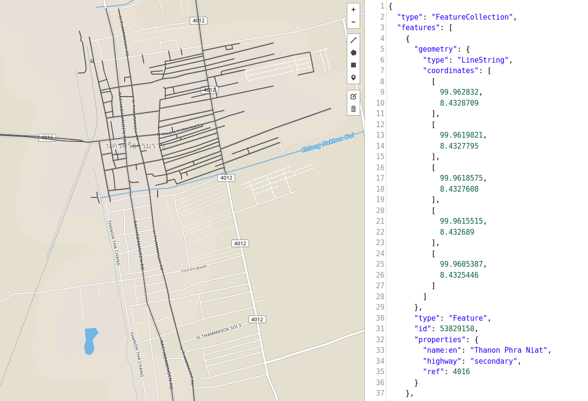
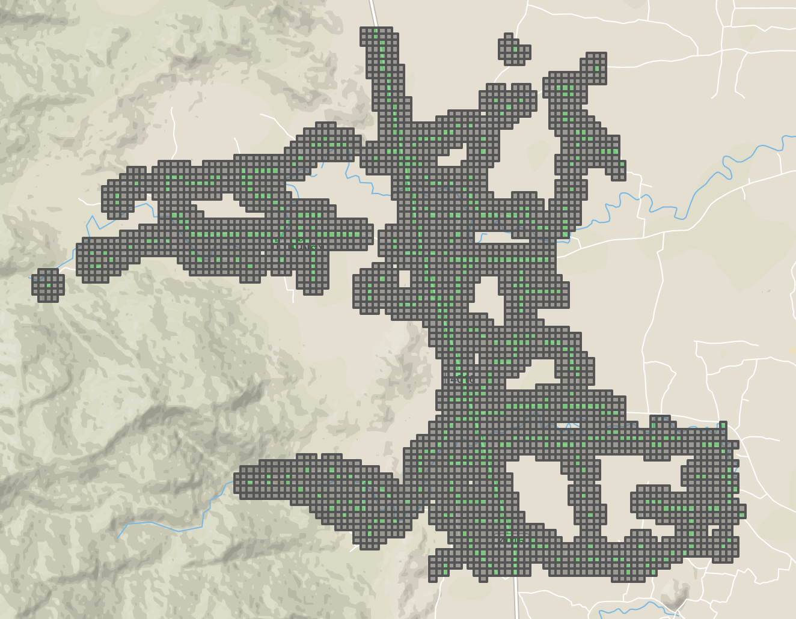
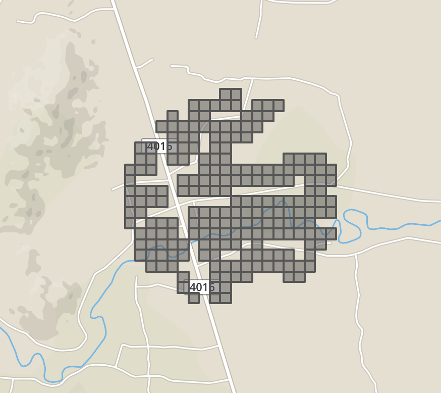

# Street View Image Metadata

The **Street View API metadata** requests provide data about Street View panoramas. Using the metadata, you can find out if a Street View image is available at a given location which **No quota is consumed** .


## Missing Streets
Overall missing-streets in Nakhon-si-thammarat province

Left (an available of Google street view images), Right (linestrings of the missing streets)


## Example of metadata
* street view available
```json
{"copyright": "© Google, Inc.",
 "date": "2016-06",
 "location": {"lat": 8.601592312833652, "lng": 99.80298133747272},
 "pano_id": "u5Hn4GeNtMtk1EvLOa-N5w",
 "status": "OK"}
```
* street view *unavailable*
```json
{"status": "ZERO_RESULTS"}
```

## Methods
*  **Method 1** Original points (left) & Missing Points (right)


* **Method 2**: Linestring with road properites



* **Method 3**: using Boxes




**Ref** [Gooogle street view matedata api](https://developers.google.com/maps/documentation/streetview/metadata)
